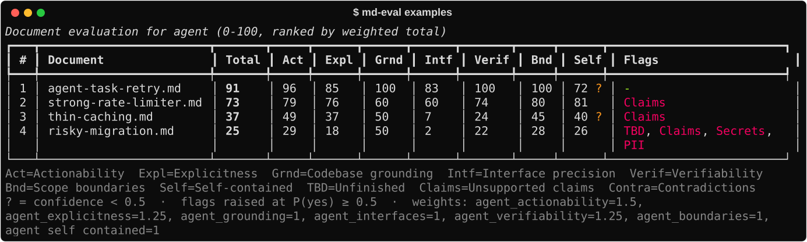
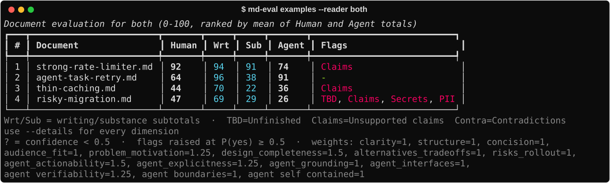

# md-eval

A CLI that scores Markdown technical documents and RFCs using [TypeSafe](https://docs.typesafe.ai)
(Jev System One model). It can evaluate a document for **human readers**, for
**AI coding agents** that will implement from it, or both (`--reader agent|human|both`, default `agent`).
`--reader page` judges general writing instead (reports, write-ups, explainers).
Each document goes out as one request, and the model answers every question in parallel:

| Reader | Group | Dimensions | Primitive |
| --- | --- | --- | --- |
| human | Writing quality | Clarity, Structure, Concision, Audience fit | Score (5 levels) |
| human | Content substance | Problem & motivation, Design completeness, Alternatives & trade-offs, Risks & rollout | Score (5 levels) |
| agent | AI agent readiness | Actionability, Explicitness, Codebase grounding, Interface precision, Verifiability, Scope boundaries, Self-contained | Score (5 levels) |
| page | Published page | Main point, Clarity, Structure, Concision | Score (5 levels) |
| all | Risk flags | Unfinished (TBD/TODO), Unsupported claims, Secrets, PII, Contradictions | Noul (P(yes)) |

Scores are normalized to 0–100 and combined **in code** into a weighted total per
reader (plus writing/substance subtotals for humans). Flags are reported separately
and never averaged into a total. Scores with low model confidence are marked `?`.
With `--reader both`, documents are ranked by the mean of the Human and Agent totals.



With `--reader both`, the same docs ranked for human reviewers and AI agents side by side:



## Setup

You need [uv](https://docs.astral.sh/uv/getting-started/installation/) and a TypeSafe API
key from https://console.typesafe.ai. Pick one way to install:

**Claude Code plugins**: see [Use with Claude Code](#use-with-claude-code). Nothing else to
install.

**Standalone CLI**: installs the `md-eval` command from a release:

```sh
uv tool install git+https://github.com/ash-singh/md-eval@v0.1.0
export TYPESAFE_API_KEY=...   # add to ~/.zshrc to keep it
md-eval examples/
```

**From source**: for development. Use `uv run md-eval` from the repo:

```sh
git clone https://github.com/ash-singh/md-eval && cd md-eval
uv sync
cp .env.example .env   # then add your key
```

The key is read from the environment, or from a `.env` file found by searching upward
from the current directory. `--dry-run` works without a key.

## Usage

```sh
uv run md-eval examples/                        # agent-readiness of every .md/.markdown file (recursive)
uv run md-eval rfc-*.md --details               # per-dimension breakdown with the chosen level
uv run md-eval specs/ --reader human             # evaluate for human readers instead
uv run md-eval specs/ --reader both --details    # human and agent scores side by side
uv run md-eval report.md --reader page           # general writing: reports, write-ups, explainers
uv run md-eval docs/ --audience "SREs new to the payments stack"
uv run md-eval docs/ --weight design_completeness=3 --weight agent_verifiability=2
uv run md-eval docs/ --json results.json        # raw scores, confidences, level probabilities
uv run md-eval docs/ --json - | jq '.[].totals' # JSON on stdout, table on stderr
uv run md-eval docs/ --dry-run                  # show the request + token estimates, no API call
```

The screenshots are real runs, regenerated with `uv run python scripts/screenshots.py`
(this calls the API).

Other options: `--flag-threshold` (default 0.5), `--min-confidence` (default 0.5),
`--concurrency` (default 4), `--model` (default `jev-latest`). The exit code is 1 if
any document failed or was skipped.

## Decide between options

`md-eval decide` scores a decision instead of a document: 2 or more options against
weighted criteria and hard constraints. One request asks Jev, in parallel:

- a Score per option and criterion, combined into a weighted total in code
- per option and constraint, P(the option violates it). Any violation rules the option out
  and never averages away
- per option, P(too vague to judge), and for the decision, P(it depends on something only
  the user knows)
- one holistic Choice over the options plus "none fit", as a cross-check

Code turns that into a `status`: `proceed`, `ask_user` (close margin, uncertain scores that
could flip the result, a disagreeing holistic pick, or user input needed), `clarify_options`
or `no_viable_option`, with the `reasons`.

```sh
uv run md-eval decide examples/decisions/profile-cache.json
uv run md-eval decide decision.json --json -      # full result as JSON on stdout
uv run md-eval decide decision.json --dry-run     # show the request, no API call
cat decision.json | uv run md-eval decide -       # read from stdin
```

The input format is in `examples/decisions/profile-cache.json` and `md-eval decide --help`.
Thresholds are flags: `--veto-threshold`, `--vague-threshold`, `--ask-threshold`, `--margin`,
`--min-confidence`.

Jev weighs the facts it is given; it is not a reliable source of specialist knowledge. In a
test on adding a column to a 50M-row PostgreSQL 15 table, it vetoed the correct plain
`ADD COLUMN ... DEFAULT` (safe since PostgreSQL 11) and returned `ask_user`. With that fact
stated in `context`, it picked it at 94/100 with `proceed`. Put the facts that settle a
decision in `context`.

## Use with Claude Code

This repo is also a Claude Code plugin marketplace with three plugins:

- **`md-eval`**: two skills. `eval-docs`: ask Claude to "review this spec" or "is this
  doc ready for an agent?" and it runs md-eval and reports the scores. `decide-options`:
  Claude can get an independent second opinion from `md-eval decide` when it faces a
  consequential choice. It decides when that is worth it, or you can ask ("compare these
  approaches with md-eval decide").
- **`md-eval-plan-gate`** (optional): a hook that scores every plan before Claude leaves
  plan mode. A plan scoring below 60/100 for agent readiness, or raising a flag, is sent
  back once with its weakest dimensions so Claude can fill the gaps. For example, a
  one-line "add caching" plan scored 23 and was sent back, and a plan with files, steps
  and test commands scored 89 and went straight through.
- **`md-eval-artifact-gate`** (optional): a hook that checks each written page before
  Claude publishes it as an artifact. It sends a page back once when its writing scores
  below 60/100 for its readers, or when it raises the Secrets, PII, Unfinished or
  Contradictions flag. Apps, dashboards and games are only checked for flags, not judged
  as prose. Pages under 150 words, and republishes with unchanged text, aren't checked.

Setup needs [uv](https://docs.astral.sh/uv/getting-started/installation/) and a TypeSafe
key. No plugin needs a separate install. They run md-eval through `uvx`, pinned to the
release tag that matches the plugin version. The skills and gates send the text they
check (docs, decisions, plans, pages) to the TypeSafe API.

```sh
claude plugin marketplace add ash-singh/md-eval
claude plugin install md-eval@md-eval
claude plugin install md-eval-plan-gate@md-eval          # optional
claude plugin install md-eval-artifact-gate@md-eval      # optional
echo 'export TYPESAFE_API_KEY=...' >> ~/.zshrc           # from https://console.typesafe.ai
```

You can also install from inside a session with `/plugin marketplace add ash-singh/md-eval`
and `/plugin install md-eval@md-eval`. Restart Claude Code afterwards so it picks up
the key.

### Using it

The skill triggers on requests like these:

- "Is `docs/rfc-042.md` ready for an agent to implement?"
- "Score every spec in `specs/` for human reviewers and agents."
- "Improve this task doc until it scores 80+ for an agent."

Claude runs md-eval, reports the total, the weakest dimensions and any raised flags, and
when asked, edits the doc and re-runs it to show before and after scores.

The gates need no prompting. Use plan mode and artifacts as usual. When a plan is sent
back, you see `md-eval: plan scored N/100 for agent readiness — sent back for revision`
and Claude revises it, asking you when a gap needs your input. When a page is sent back,
Claude improves the writing it produced itself, removes anything that looks like a
credential, and asks you before removing personal details. It doesn't rewrite content you
supplied. If you want the page as it is, ask Claude to publish again: each file is sent
back at most once per session.

The artifact gate only sees pages published with the Artifact tool. Documents written
through a docs connector (such as Claude Docs) aren't checked.

### Gate settings

Both gates let Claude continue if anything goes wrong (network, oversized text). Without
a key, each says so once per session. Tune them with environment variables:

| Variable | Default | Meaning |
| --- | --- | --- |
| `MD_EVAL_PLAN_MIN_SCORE` | `0.6` | Send back plans whose agent total is below this (0-1) |
| `MD_EVAL_PLAN_FLAG_THRESHOLD` | `0.5` | Send back plans with a flag at or above this P(yes) |
| `MD_EVAL_PLAN_MAX_BLOCKS` | `1` | Times a plan can be sent back per session |
| `MD_EVAL_PLAN_MIN_CONFIDENCE` | `0.5` | Mark scores below this confidence as low confidence |
| `MD_EVAL_ARTIFACT_MIN_SCORE` | `0.6` | Send back written pages whose page total is below this (0-1) |
| `MD_EVAL_ARTIFACT_BLOCK_FLAGS` | `secrets,pii,unfinished_content,contradictions` | Flags that send a page back (comma-separated flag ids) |
| `MD_EVAL_ARTIFACT_FLAG_THRESHOLD` | `0.5` | P(yes) at which a flag counts as raised |
| `MD_EVAL_ARTIFACT_MAX_BLOCKS` | `1` | Times each file can be sent back per session |
| `MD_EVAL_ARTIFACT_MIN_WORDS` | `150` | Pages with fewer words are not checked |
| `MD_EVAL_ARTIFACT_DOC_THRESHOLD` | `0.5` | P(written document) at which a page's writing is scored |
| `MD_EVAL_ARTIFACT_MIN_CONFIDENCE` | `0.5` | Mark scores below this confidence as low confidence |

### Decision log

Each gate check and `md-eval decide` run adds one line to a local log at
`~/.cache/md-eval/decisions.jsonl`. It records scores, outcomes, raised flags, reason codes
and API time. Text, session ids and file paths are stored only as short hashes, so the log
never contains your plans, pages or decisions. It is never sent anywhere. Summarize it with:

```sh
md-eval stats          # or: uvx --from git+https://github.com/ash-singh/md-eval md-eval stats
```

The summary shows, per tool, how often each outcome happened, median and p90 API time, the
most common reasons and flags, and whether revised plans and pages scored higher after
being sent back. API time excludes `uvx` startup, which adds to what you notice. Set
`MD_EVAL_LOG=off` to disable the log, or `MD_EVAL_LOG=<path>` to move it.

### Update, disable, remove

```sh
claude plugin marketplace update md-eval                 # fetch the latest release list
claude plugin update md-eval@md-eval                     # then restart Claude Code
claude plugin update md-eval-plan-gate@md-eval
claude plugin update md-eval-artifact-gate@md-eval
claude plugin disable md-eval-plan-gate@md-eval          # turn a gate off, keep it installed
claude plugin uninstall md-eval-artifact-gate@md-eval    # remove it
```

Plugins change only when a new release is published. Commits to `main` don't affect
installed plugins.

## Development

```sh
uv sync
uv run pytest        # offline: the API is mocked, no key or network needed
```

CI runs the tests and the `--dry-run` commands on every push and pull request.

## Releasing

For maintainers. Releases are cut from a clean `main`:

```sh
scripts/release.sh 0.2.0
git push origin main v0.2.0
```

The script runs the tests, then sets one version in `pyproject.toml` and every `plugin.json` file, re-pins the
plugins' `uvx` sources to the new tag, runs `claude plugin validate`, then commits and
tags. Update the skills in `plugins/md-eval/skills/` first if CLI flags or JSON
fields changed.

## Customizing

All dimensions are defined as data in `src/md_eval/dimensions.py`. Edit
instructions, level descriptions or default weights there. Changing weights or
thresholds doesn't change what the model judged. The `--json` output keeps the raw
per-dimension scores, so you can re-weight them without calling the API again.

## Limits

Jev accepts ~32k tokens of state per request. Documents estimated above ~28k tokens
are skipped with a message rather than truncated, because dimensions like
"Risks & rollout" need the whole document.

## Examples

`examples/` holds sample docs for trying the tool:

| File | Written for | Expected result |
| --- | --- | --- |
| `strong-rate-limiter.md` | Human reviewers | Highest human score. Unsupported claims is borderline (P(yes) about 0.5) because the "~40x the Redis memory" estimate has no calculation |
| `agent-task-retry.md` | An AI coding agent | Highest agent score, low human substance score |
| `thin-caching.md` | Nobody in particular | Low scores on both, Unsupported claims flag |
| `risky-migration.md` | Flag testing | Lowest agent score, Unfinished, Unsupported claims, Secrets and PII flags |

> **All credentials, hostnames, names and contact details in `examples/` are fabricated.**
> They exist only so the Secrets and PII flags have something to detect. None of them
> are real or were ever valid. The notice lives here rather than inside the sample docs
> so it doesn't influence the evaluation. `.github/secret_scanning.yml` excludes
> `examples/` from GitHub secret scanning.
